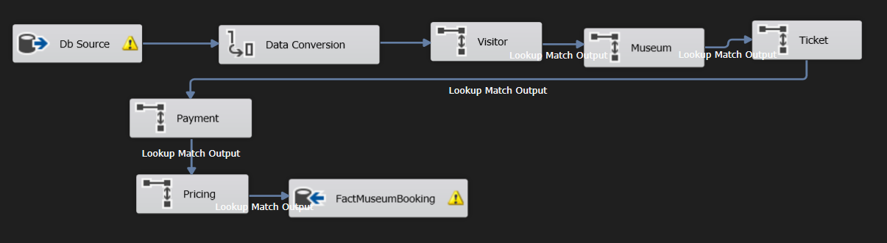
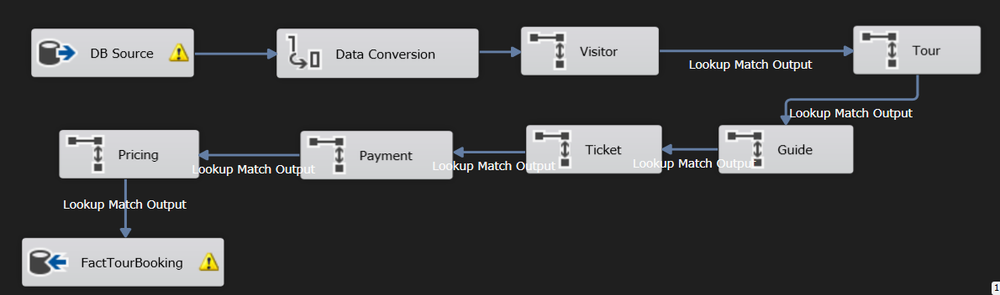
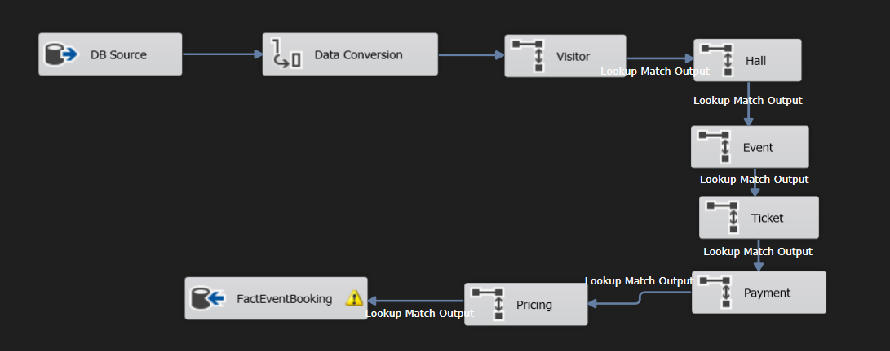
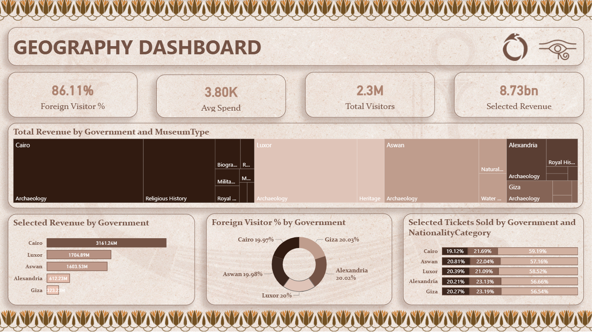

# 🏛️ KEMET – Egyptian Museums Management & Analytics Platform

<div align="center">

### Transforming Egyptian Museum Operations into Actionable Insights

End-to-End Business Intelligence Solution for Egyptian Museums


<br>

### 🇪🇬 Preserving History Through Data

An Enterprise-Scale Business Intelligence Platform Designed to Analyze, Monitor, and Optimize Egyptian Museum Operations.

</div>

---

## 👥 Project Team

| Team Member |
|------------|
| Shrouk Ehab |
| Nouran Yasser |
| Noha Ahmed |
| Basmala Khaled |
| Ghada Ali |

---

# 📖 Overview

KEMET is an end-to-end Business Intelligence and Analytics platform developed to support Egyptian museums through data-driven decision-making.

The project simulates a nationwide museum ecosystem covering:

- Museum Operations
- Visitor Management
- Guided Tours
- Cultural Events
- Museum Artifacts
- Museum Halls
- Pricing Strategies
- Revenue Tracking
- Payment Analysis
- Operational Performance

The platform transforms raw operational data into strategic business insights through a complete BI pipeline.

---

# 🎯 Project Objectives

- Centralize museum operational data.
- Analyze visitor demographics and behavior.
- Monitor museum performance.
- Measure revenue and profitability.
- Track event and tour success.
- Improve operational efficiency.
- Support strategic decision-making.
- Enable self-service analytics.
- Provide AI-powered natural language insights.

---

# 🏗️ Solution Architecture

```text
Generated Data
       │
       ▼
SQL Server OLTP Database
       │
       ▼
SSIS ETL Process
       │
       ▼
Data Warehouse
(Galaxy + Snowflake Schema)
       │
 ┌─────┼─────┐
 ▼     ▼     ▼
SSRS  Power BI  AI Chatbot
Reports Dashboards Analytics
```

---

# 📂 Repository Structure

```text
KEMET
│
├── Data
│   ├── Generated Datasets
│   ├── Data Dictionary
│   └── Documentation
│
├── ERD
│   ├── Final ERD
│   └── Database Design
│
├── Mapping
│   ├── Source-To-Target Mapping
│   └── ETL Documentation
│
├── DWH
│   ├── Galaxy Schema
│   ├── Snowflake Schema
│   ├── Fact Tables
│   ├── Dimension Tables
│   └── Bridge Tables
│
├── SSIS
│   ├── ETL Packages
│   ├── Fact Loads
│   ├── Dimension Loads
│   └── SCD Processes
│
├── SSRS
│   ├── Operational Reports
│   └── Analytical Reports
│
├── Dashboards
│   ├── Power BI Dashboards
│   └── KPI Analysis
│
├── Chatbot
│   ├── Backend API
│   ├── SQL Integration
│   └── Analytics Assistant
│
└── Presentation
```

---

# 📊 Dataset Overview

The project uses large-scale simulated datasets representing Egyptian museum operations from 2021–2026.

| Dataset | Records |
|----------|----------:|
| Visitor | 2,300,000 |
| Museum Booking | 5,000,000 |
| Tour Booking | 3,000,000 |
| Event Booking | 2,500,000 |
| Museum | 72 |
| Hall | 720 |
| Artifact | 14,400 |
| Guide | 4,060 |
| Tour | 656 |
| Event | 500 |
| Pricing | 3,240 |

### Total Dataset Size

### 🚀 17+ Million Records

---

# 🗄️ Operational Database (OLTP)

The OLTP database was designed to support daily museum operations while ensuring data integrity, scalability, and transactional efficiency.

## Core Entities

- Museum
- Hall
- Artifact
- Visitor
- MuseumBooking
- Tour
- TourBooking
- Event
- EventBooking
- Guide
- Language
- Pricing
- Payment

## Database Features

- Fully Normalized Design
- Primary & Foreign Keys
- Business Rule Enforcement
- Referential Integrity
- Optimized Transaction Processing
- High Scalability

---

# 🧩 Entity Relationship Diagram (ERD)


---

# 🔄 ETL Process (SSIS)

The ETL layer was developed using SQL Server Integration Services (SSIS) to move data from the operational database into the analytical warehouse.

## ETL Workflow

1. Extract Source Data
2. Validate Data
3. Clean Data
4. Transform Records
5. Generate Surrogate Keys
6. Load Dimensions
7. Load Bridge Tables
8. Load Facts
9. Execute Validation Checks
10. Audit & Logging

## ETL Features

- Lookup Transformations
- Data Cleansing
- Error Handling
- Incremental Loading
- Audit Tracking
- SCD Implementation
- Data Validation

---

## 📸 ETL Packages

### Museum Booking Fact



### Tour Booking Fact



### Event Booking Fact



---

# 🏛️ Data Warehouse (DWH)

The KEMET Data Warehouse combines both Galaxy Schema and Snowflake Schema approaches to balance performance, scalability, and maintainability.

---

## Galaxy Schema

The Galaxy Schema serves as the primary analytical model and shares dimensions across multiple business processes.

### Fact Tables

- FactMuseumBooking
- FactTourBooking
- FactEventBooking

### Shared Dimensions

- DimDate
- DimTime
- DimMuseum
- DimVisitor
- DimTicket
- DimPricing
- DimPayment

---

## Snowflake Schema

Selected dimensions were further normalized to reduce redundancy and improve maintainability.

### Snowflaked Dimensions

- DimMuseum
- DimGuide
- DimArtifact
- DimLanguage
- DimLocation

---

## Bridge Tables

- BridgeGuideLanguage
- BridgeMuseumService

---

## Warehouse Features

- Galaxy Schema Design
- Snowflake Schema Design
- Shared Dimensions
- Historical Analysis
- Surrogate Keys
- Slowly Changing Dimensions (SCD)
- Enterprise Analytics Support
- Optimized Query Performance
- Scalable Architecture

---

## 🏗️ Warehouse Architecture

> Full warehouse diagram is available inside the DWH folder.


---

# 📋 SSRS Reports

The reporting layer provides operational and analytical reports for decision-makers and museum administrators.

## Reports Included

- Revenue Summary Report
- Visitor Analysis Report
- Museum Performance Report
- Event Performance Report
- Tour Guide Performance Report

## Reporting Features

- Interactive Parameters
- Filtering & Sorting
- KPI Aggregation
- Drill Down
- PDF Export
- Excel Export

---

## 📸 SSRS Reports Gallery

### Revenue Summary Report


### Museum Performance Report


### Visitor Analysis Report


### Tour Guide Performance Report


---

# 📈 Power BI Dashboards

The project includes 20 interactive dashboards providing a comprehensive view of museum operations.

---

## Dashboard Categories

### Executive Analytics

- Executive Command Center
- Revenue Analysis
- Museums Overview

### Visitor Analytics

- Visitor Segmentation
- Customer Loyalty
- Nationality Behaviour

### Operational Analytics

- Hall Utilization
- Crowd Control
- Museum Staff
- Guide Performance

### Business Analytics

- Payment Behaviour
- Pricing & Discounts
- Ticket Type Analysis
- Ticket Class Analysis

### Experience Analytics

- Event Performance
- Tour Business
- Group Experience
- Language Coverage

### Strategic Analytics

- Cultural Heritage
- Geography Analysis

---

# 📊 Dashboard Gallery

## Executive Command Center


## Geography Analysis



## Guide Performance


## Museum Overview


## Payment Behaviour


## Hall Operation


## Cultural Heritage


## Customer Loyalty


## Events Performance


---

# 🤖 AI Analytics Chatbot

An AI-powered analytics assistant was developed to allow users to interact with museum data using natural language.

---

## Features

- Arabic & English Support
- Revenue Queries
- Visitor Analytics
- Museum Performance Analysis
- Dashboard Navigation Assistance
- KPI Exploration
- Real-Time Data Retrieval

---

## Technologies

- Node.js
- Express.js
- SQL Server
- REST APIs

---

# 📊 Business Insights Enabled

The platform supports analysis of:

- Revenue Performance
- Visitor Demographics
- Nationality Trends
- Museum Popularity
- Event Attendance
- Tour Occupancy
- Guide Performance
- Payment Behaviour
- Crowd Management
- Language Coverage
- Visitor Loyalty
- Cultural Heritage Analytics

---

# 🛠️ Technology Stack

## Database

- SQL Server

## Data Warehouse

- Galaxy Schema
- Snowflake Schema
- Dimensional Modeling

## ETL

- SSIS

## Reporting

- SSRS

## Business Intelligence

- Power BI
- DAX
- Power Query

## Backend

- Node.js
- Express.js

## Version Control

- Git
- GitHub

---

# 🚀 End-to-End Workflow

```text
Data Generation
       ↓
OLTP Database
       ↓
ETL (SSIS)
       ↓
Data Warehouse
       ↓
SSRS Reports
       ↓
Power BI Dashboards
       ↓
AI Analytics Chatbot
       ↓
Business Insights & Decision Making
```

---

# 📥 Download Dataset

<div align="center">

### Access the Complete Project Dataset

🔗 https://drive.google.com/file/d/1D4KKv-F4yp3KShRb4xFpIfqscYnsFq1z/view?usp=drive_link

</div>

---

# ⭐ Project Highlights

✅ 17+ Million Records

✅ Enterprise-Scale Data Warehouse

✅ Galaxy & Snowflake Schema Design

✅ Complete OLTP → DWH → BI Pipeline

✅ Automated ETL using SSIS

✅ Advanced SSRS Reporting

✅ 20 Interactive Power BI Dashboards

✅ Arabic & English AI Analytics Chatbot

✅ End-to-End Business Intelligence Solution

✅ Realistic Egyptian Museum Ecosystem

---

<div align="center">

## 🏛️ KEMET

### Preserving History Through Data

⭐ If you found this project interesting, consider starring the repository.

</div>
